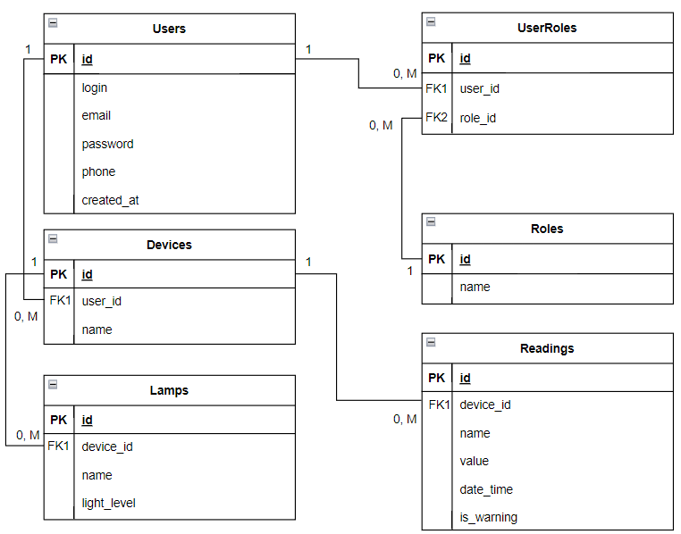
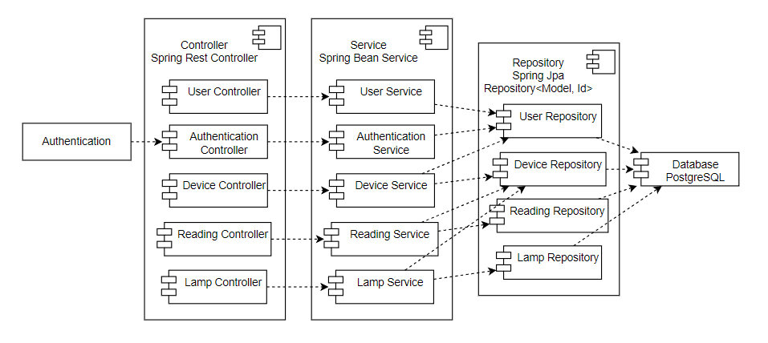
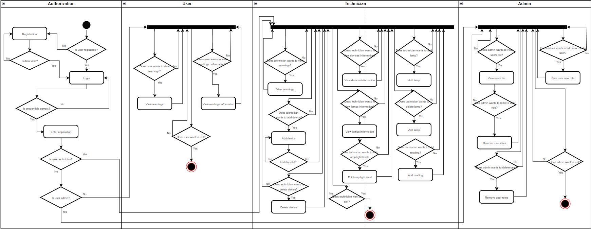
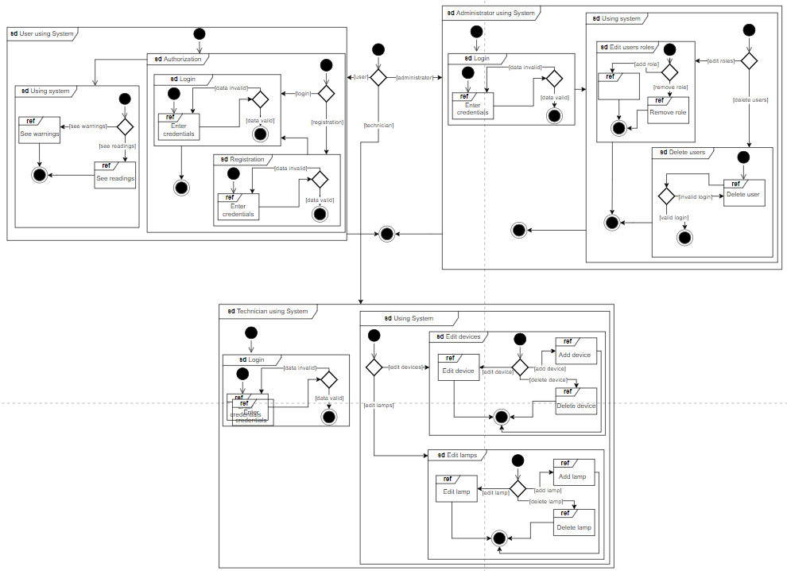

# Autolight

The Autolight Health Monitoring System is a project aimed at integrating health indicators with ambient lighting.
This application utilizes a combination of health monitoring devices and connected lamps to adjust lighting levels based
on an individual's health status. The core concept revolves around using real-time health data to dynamically regulate
the lighting environment, promoting wellness and comfort.

Technicians can add Devices to Users and each Device can read some data about Users’ health,
Users can look at warnings about their health and change Lamps characteristics based on this.

### Stack:

Java 17, Spring Boot 3, Spring Security, Spring Data Jpa + Hibernate, PostgreSQL

### Entity-Relational Diagram

### Component Diagram

### Use Case Diagram

### Activity Diagram

### Interaction Diagram

